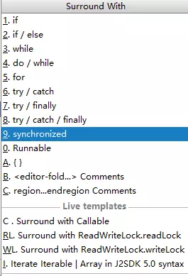

# 常用快捷键

这里主要是 Windows 上的快捷键，Mac 上部分快捷键会有一点点小小差异。

- **Ctrl+N**

这个可以用来快速搜索类。

- Ctrl+Shift+N

这个可以用来快速搜索文件。

- Ctrl+ALT+SPACE

代码提示（类似于ALT+/），这个快捷键使用场景并不多，大部分情况下 IDEA 都会主动提示。

- ALT+F7

这个用来查看某一个方法或者变量在哪里被使用了。

- Ctrl+Q

查看代码提示及内容，这个说起来并没有 Eclipse 方便，Eclipse 中将光标放在类名或者方法名上就会出现 doc，但是在 IDEA 中需要按下 Ctrl+q 才会出现。

- Ctrl+B

查看类的定义，也可以像 Eclipse 一样，按下 Ctrl 再鼠标左键单击。

- **Ctrl+F12**

这个可以列出类中的所有方法。

- SHIFT+F6

变量或者类名重命名。

- ALT+INSERT

生成 get/set/toString/hashCode/equals 等方法

- Ctrl+ALT+T

代码包裹，选中代码后，可以被 for/if/trycache 等代码块包裹：

- Ctrl+ALT+B

查看接口或者抽象类的子类。也可以通过 Ctrl+H 来查看。

- Ctrl+D

代码复制到新的一行

- Ctrl+Y

删除当前行

- Ctrl+Alt+↑/↓

代码向上或者向下移动

- Ctrl+Alt+enter

在当前行的上面创建新的一行

- Ctrl+enter

在当前行的下面新建一行（光标不用移动到当前行的最末尾处）。

好了，本文就当是一个引子吧，后面再来和大家详细聊聊 IDEA 中的其他细节。