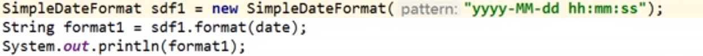
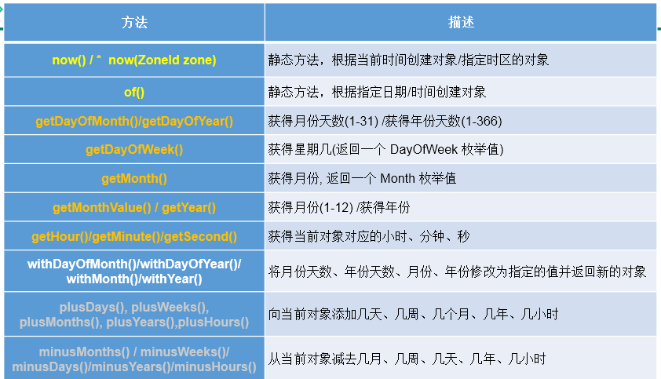

 Java语言层面的高级阶段

## day01

## 多线程

### 多线程基本概念

> 

- 单核与多核的理解

> 

- 使用多线程的优点

- > 

### 线程的创建和使用

- 如何看是否为多线程，一条线是否可以画出来

- 多线程的创建：

- > **方式一：**
  >
  > 
  >
  > start的作用，使得线程开始执行，**启动当前进程，调用当前线程的run（）**，看你是否重写
  >
  > 问题1;不用start，直接run()不是并发执行，虽然可以执行就变为正常的方法执行，而不是并发执行。
  >
  > 问题2：同一个线程只能启动一次，否则会报异常，多线程就造多个对象
  >
  > **方式二：**  
  >
  >  
  >
  > 
  >
  > 
  >
  > 第二种实现接口的卖票方法中，就不需要声明static的变量了，因为**只造了一个对象，放到了三个构造器之中**。
  >
  > 实现类是实现了Runable中国接口，继承是继承了Thread类
  >
  > 两种方式的对比：
  >
  > 
  >
  > 开发中优先使用第二种方式，第二种实现的方式还可以继承，**天然地实现共享的数据**。例如在线程同步中比较方便设置同步监视器
  >
  > 

- Thread常用方法的使用：

- > 
  >
  > 
  >
  > 方法注意事项：
  >
  > 构造器或者setName来设置线程的名字
  >
  > join执行完后才释放处理机。

  - 线程优先级的设置

- > 

  - 线程的生命周期

  > 几种状态
  >
  > 
  >
  > 状态转换
  >
  > 
  >
  >  

  - 理解线程的安全问题;

  >   共享变量

  - 线程安全问题的举例和解决措施

  > 
  >
  > Java中通过同步机制解决线程安全问题，同步代码块，同步方法
  >
  > 解决措施：
  >
  > **方式一**：同步代码块
  >
  > 
  >
  > 
  >
  > 
  >
  > 
  >
  > 这样就不安全了，就不是三个窗口公共同一个锁。就是要同一个对象。
  >
  > 对于同一把锁的说明：实现类的方式中共享了锁，但是在**继承**中，必须要声明锁的对象为**static**，慎重使用，可以使用当前类。
  >
  > 简便的唯一的对象可用，可以使用this保证其唯一即可，比如实现类的创建方式中，就可以使用this，**唯一的类的对象this**。或者练习之中公用的account
  >
  > 另一种写法，拿当前的   **类.class** 也可以，另一个角度看的话类也是对象。
  >
  > 
  >
  > 
  >
  > **方式二**：同步方法

  > 
  >
  > 上面的是解决在实现类的之中，默认使用的是this，没问题。
  >
  > 如果将上面的方法使用在继承之中，this就由三个是不可以的，这是只能考虑将方法写为**静态**的，此时this指向的就是类
  >
  > 
  >
  > 这时候锁就是**当前的类.class**
  >
  > - 同步方法的**总结**：
  >
  > 
  >
  > 
  >
  > 两种方式可以解决线程的安全问题但是同步代码块变成了单线程问题，效率低。

- 线程安全的单例模式之懒汉模式：

  >  
  >
  > 不安全之处在于会被两次创建对象，有两个线程且还有共享数据
  >
  > 修改为：
  >
  > 
  >
  > 此时锁就是类.class,但是这样效率较差，可以加个判断语句
  >
  > 
  >
  > 方式二效率高一点

- 两种方式创建匿名线程对象的方法：

  > 
  >
  > 上面为实现类的方法，第一种继承的方法如下
  >
  > 
  >
  > }
  >
  > }.start();
  >
  > 匿名线程
  >
  > 
  >
  > 

### 死锁问题


- 死锁的例子：康师傅举例：两个线程互相想进锁但是都被对方占有了。

### Lock锁

解决同步问题的方式三

是一个接口，需要有实现类ReentrantLock


公平，先进先出

使用方法;


保证lock之后都是单线程的，放在finallu保证最后始终会释放锁

- 面试题：synchronized 和 Lock的异同？

  > 
  >
  > 一般都使用synchronized
  >
  > 

- 面试题2：如何解决线程的安全问题？几种方式？

### 线程通信

线程通信的例子：使用两个线程打印 1-100。线程1, 线程2 交替打印
 *

 * 涉及到的三个方法：

 * wait():一旦执行此方法，当前线程就进入阻塞状态，并**释放**同步监视器。

 * notify():一旦执行此方法，就会唤醒被wait的一个线程。如果有多个线程被wait，就唤醒优先级高的那个。

 * notifyAll():一旦执行此方法，就会唤醒所有被wait的线程。

     

 * 说明：

 * 1.wait()，notify()，notifyAll()三个方法**必须使用在同步代码块或同步方法中**。

 * 2.wait()，notify()，notifyAll()三个方法的**调用者**必须是**同步代码块或同步方法中的同步监视器**。

 * 否则定义一个Object对象时候，就会出现IllegalMonitorStateException异常，或者使用obj.wait(),因为默认的是使用**this**

 * 3.wait()，notify()，notifyAll()三个方法是定义在java.lang.Object类中。

 * 面试题：==sleep() 和 wait()的异同==？

 * 1.相同点：一旦执行方法，都可以**使得当前的线程进入阻塞状态**。

 * 2.==不同点==：

 * 1）两个方法声明的位置不同：**Thread类**中声明静态的sleep() , **Object类**中声明wait()

 * 2）调用的要求不同：sleep()可以在**任何需要的场景**下调用。 wait()必须使用在**同步代码块**或**同步方法**中

 * 3）关于是否释放同步监视器：**如果两个方法都使用在同步代码块或同步方法中**，sleep()不会释放锁，wait()会释放锁。

 * 4）sleep会自己醒来，wait不会

**wait（）会释放锁，此点和sleep（）有区别**

还得搭配notify或者notifyAll

### jdk8.0新增加的创建进程的方式

方式一：实现Callable接口（JDK5.0新增加的）


Runnable  run Callable  call

如何创建？


```java
/**
 * 创建线程的方式三：实现Callable接口。 --- JDK 5.0新增
 * @author shkstart
 * @create 2019-02-15 下午 6:01
 */
//1.创建一个实现Callable的实现类
class NumThread implements Callable{
    //2.实现call方法，将此线程需要执行的操作声明在call()中
    @Override
    public Object call() throws Exception {
        int sum = 0;
        for (int i = 1; i <= 100; i++) {
            if(i % 2 == 0){
                System.out.println(i);
                sum += i;
            }
        }
        return sum;
    }
}


public class ThreadNew {
    public static void main(String[] args) {
        //3.创建Callable接口实现类的对象
        NumThread numThread = new NumThread();
        //4.将此Callable接口实现类的对象作为传递到FutureTask构造器中，创建FutureTask的对象
        FutureTask futureTask = new FutureTask(numThread);
        //5.将FutureTask的对象作为参数传递到Thread类的构造器中，创建Thread对象，并调用start()
        new Thread(futureTask).start();

        try {
            //6.获取Callable中call方法的返回值
            //get()返回值即为FutureTask构造器参数Callable实现类重写的call()的返回值。
            Object sum = futureTask.get();
            System.out.println("总和为：" + sum);
        } catch (InterruptedException e) {
            e.printStackTrace();
        } catch (ExecutionException e) {
            e.printStackTrace();
        }
    }

}
```

如何理解实现Callable接口的方式创建多线程比实现Runnable接口创建多线程方式**强大**？

 * 1. call()可以有返回值的。
 * 2. call()可以抛出异常，被外面的操作捕获，获取异常的信息
 * 3. Callable是支持泛型的

### 线程池（开发中常用此方法）（**练习**）


如何创建：

```java
    public static void main(String[] args) {
        //1. 提供指定线程数量的线程池
        ExecutorService service = Executors.newFixedThreadPool(10);
        ThreadPoolExecutor service1 = (ThreadPoolExecutor) service;
        //设置线程池的属性
//        System.out.println(service.getClass());
//        service1.setCorePoolSize(15);
//        service1.setKeepAliveTime();


        //2.执行指定的线程的操作。需要提供实现Runnable接口或Callable接口实现类的对象
        service.execute(new NumberThread());//适合适用于Runnable
        service.execute(new NumberThread1());//适合适用于Runnable

//        service.submit(Callable callable);//适合使用于Callable
        //3.关闭连接池
        service.shutdown();
    }
```


## day03

### 复习

- 同步监视器对于多个线程来说是同一个对象即可

- synchronized包含住共享数据的代码，别包多也别少

- 同步方法非静态的时候，锁为当前的类的对象this，如果是静态的方法那么是当前类本身，类就加载一次是唯一的

- 线程安全的单例模式

  两种写法

- 新增加的两种方法：callable和线程池

- > 

- > 

## java常用类

### 目录

> 

### string类


```java
/*
String:字符串，使用一对""引起来表示。
1.String声明为final的，不可被继承
2.String实现了Serializable接口：表示字符串是支持序列化的。
        实现了Comparable接口：表示String可以比较大小
3.String内部定义了final char[] value用于存储字符串数据
4.String:代表不可变的字符序列。简称：不可变性。
    体现：1.当对字符串重新赋值时，需要重写指定内存区域赋值，不能使用原有的value进行赋值。
         2. 当对现有的字符串进行连接操作时，也需要重新指定内存区域赋值，不能使用原有的value进行赋值。
         3. 当调用String的replace()方法修改指定字符或字符串时，也需要重新指定内存区域赋值，不能使用原有的value进行赋值。
5.通过字面量的方式（区别于new）给一个字符串赋值，此时的字符串值声明在字符串常量池中。
6.字符串常量池中是不会存储相同内容的字符串的。
 */
```

底层实际是存放到了上面图片中的final字符数组之中

#### String的实例化

字面量定义  常量池

new + 构造器  在堆中，只要是改了一定是新建了一个string


- 一道小题目

> 
>
> 通过字面量定义了两个对象的name，所以是true

- 一道面试题

> 

#### String不同拼接操作的对比

- 一道**思考题**

> 

#### 一道面试题（**重点）**

> 
>
> output：good best
>
> 
>
> 
>
> 考察的是值传递，基本数据类型传的是值，引用数据类型传递的是地址
>
> 第二个str是地址，不可改变出了方法之后，又变成了之前的字符串并且对象的str是不改变的

### String的常用方法

#### 目录1


#### 目录2


#### 目录3


### String与其他结构的转化

#### String和基本数据类型转换（重点）


#### String与char[] 转换

- String------>转换为char[ ]


- char[ ]转换为String调用Sting的构造器即可，要是调用Arrays.toString(),输出的就是原封不动打印数组


#### String和字节数组之间的转换


反过来转换仍然是调用构造器，编码解码可以使用**不同的编码解码规则**，不使用默认的就要指定好。

#### String和StringBuffer/StringBuilder的转换


#### 解决一个拼接的问题


加了final就是常量了，拼接之后还是在常量池之中。

### StringBuffer和StringBulider

#### 一道面试题


StringBuffer线程安全的是因为几乎每个方法就加了synch

#### StringBuffer的源码分析

> 空参构造创建了16长度的数组
>
> 有参数时候，就是abc长度加上16
>
> length返回的是count
>
> 

#### StringBuffer与Builder的方法

> 
>
> Bulider与之类似

#### 三者效率对比


效率从高到低排列

### JDK8之前的日期时间API

#### currentTimeMillis()


返回的是毫秒数，称之为时间戳，计算时间差

#### Date类

在两个地方有

所以自动导包的时候就不知道导入哪一个

- Util之中的

1. > 
   >
   > 或者构造器二
   >
   > 

- java.sql.date

  > 对于数据库之中的时间 
  >
  > 
  >
  > 
  >
  > 强制转换不可以，将父类转换为子类

#### 关于强制转换的几点说明：


得先创建一个s赋值p，然后向下转型，强制转换，感觉是多态里面的向下转型


new的就是一个父类，转换为子类不可以

## day04

### SimpleDateFormat

字符串和日期之间的相互转换

- SimpleDateFormat的使用

  - 格式化，日期到字符串

    ```java
    SimpleDateFormat sdf = new SimpleDateFormat();
    
    //格式化：日期 --->字符串
    Date date = new Date();
    System.out.println(date);
    
    String format = sdf.format(date);
    System.out.println(format); //Fri Nov 15 17:09:56 CST 2019
    ```

  - 解析，反过来

    

- 默认格式化

  

  

  前一种相当于toString方法

- 解析，字符串有格式要求

  

- 开发中常用指定格式

  

- 抛异常就是不识别传的字符串的格式

- 练习：字符串”2020-09-09“转换为java.sql.Date

  **重点**

  ```java
  Date date1 = new Date();
  System.out.println(date1);//Fri Nov 15 17:24:15 CST 2019
  
  //将时间转为字符串,date---->字符串
  SimpleDateFormat sd = new SimpleDateFormat();
  String time = sd.format(date1);
  System.out.println(time);//2019/11/15 下午5:26
  
  //字符串解析为Date,并转换为java.sql.Date
  SimpleDateFormat sd2 = new SimpleDateFormat("yyyy-MM-dd");
  String time2 = "2019-08-08";
  Date date2 = sd2.parse(time2);
  System.out.println(date2);//Thu Aug 08 00:00:00 CST 2019
  
  //转换util下Date到sql下的Date
  System.out.println(date2.getTime());//1565193600000
  java.sql.Date date3 =  new java.sql.Date(date2.getTime());//重点！！！
  System.out.println(date3);//2019-08-08
  ```

  几点说明，直接date的类，还要用sql的date类的**构造器**将其转化为sql下类

### 日历类Caalendar（抽象类）

是一个抽象类

- 方式一：使用其子类
- 方式二：调用静态方法

```java
//方式一：创建其子类（GregorianCalendar）的对象
//方式二：调用其静态方法getInstance()
Calendar c1 = Calendar.getInstance();

//2.常用方法
//get()
int days = c1.get(Calendar.DAY_OF_MONTH);
System.out.println(days);//输出这个月第几天
System.out.println(c1.get(Calendar.DAY_OF_YEAR));//输出这个年第几天

//set()
//calendar可变性
c1.set(Calendar.DAY_OF_MONTH,22);
days = c1.get(Calendar.DAY_OF_MONTH);
System.out.println(days);

//add()，在原有基础之上添加
c1.add(Calendar.DAY_OF_MONTH,-3);//19
days = c1.get(Calendar.DAY_OF_MONTH);
System.out.println(days);

//getTime():日历类---> Date
Date date = c1.getTime();
System.out.println(date);

//setTime():Date ---> 日历类
Date date1 = new Date();
c1.setTime(date1);//setTime(Date date)
days = c1.get(Calendar.DAY_OF_MONTH);
System.out.println(days);
```

### jdk8中新的API

- 出现背景，新日期API

  

- - ```java
        //now():获取当前的日期、时间、日期+时间
        LocalDate localDate = LocalDate.now();
        LocalTime localTime = LocalTime.now();
        LocalDateTime localDateTime = LocalDateTime.now();//时间+日期
    
        System.out.println(localDate);
        System.out.println(localTime);
        System.out.println(localDateTime);
        /*
        2019-11-15
        22:19:17.007858300
        2019-11-15T22:19:17.007858300
        */
    
        //of():设置指定的年、月、日、时、分、秒。没有偏移量
        LocalDateTime localDateTime1 = LocalDateTime.of(2020, 10, 6, 13, 23, 43);
        System.out.println(localDateTime1);
    
    
        //getXxx()：获取相关的属性
        System.out.println(localDateTime.getDayOfMonth());
        System.out.println(localDateTime.getDayOfWeek());
        System.out.println(localDateTime.getMonth());
        System.out.println(localDateTime.getMonthValue());
        System.out.println(localDateTime.getMinute());
    
        //体现不可变性
        //withXxx():设置相关的属性
        LocalDate localDate1 = localDate.withDayOfMonth(22);//修改后自己不变，返回修改后的
        System.out.println(localDate);
        System.out.println(localDate1);
    
    
        LocalDateTime localDateTime2 = localDateTime.withHour(4);
        System.out.println(localDateTime);
        System.out.println(localDateTime2);
    
        //不可变性
        LocalDateTime localDateTime3 = localDateTime.plusMonths(3);//加上几个月，返回的被修改的变量
        System.out.println(localDateTime);
        System.out.println(localDateTime3);
    
        LocalDateTime localDateTime4 = localDateTime.minusDays(6);//减的操作
        System.out.println(localDateTime);
        System.out.println(localDateTime4);
    ```

### java.time.Instant类的使用

瞬时,类似于前面的Date，得到的数字

```java
//now():获取本初子午线对应的标准时间
Instant instant = Instant.now();
System.out.println(instant);//2019-02-18T07:29:41.719Z

//添加时间的偏移量
OffsetDateTime offsetDateTime = instant.atOffset(ZoneOffset.ofHours(8));
System.out.println(offsetDateTime);//2019-02-18T15:32:50.611+08:00

//toEpochMilli():获取自1970年1月1日0时0分0秒（UTC）开始的毫秒数 类似于 ---> Date类的getTime()
long milli = instant.toEpochMilli();
System.out.println(milli);

//ofEpochMilli():通过给定的毫秒数，获取Instant实例  -->Date(long millis)
Instant instant1 = Instant.ofEpochMilli(1550475314878L);
System.out.println(instant1);
```

### DateTimeFormatter

未完待续，用到请前往视频尚硅谷宋红康 P485

### IDEA如何导入模块

放到对应的工程下面，但是文件夹是灰色的

点击扳手右边的按钮，点击加号，导入以及有的mudle，create。。。。

### Java比较器

希望对于Java对象可以进行比较。

Java中的对象，正常情况下，只能进行比较：==  或  != 。不能使用 > 或 < 的，但是在开发场景中，我们需要对多个对象进行排序，言外之意，就需要比较对象的大小。如何实现？使用两个接口中的任何一个：

Comparable compareTo(Object obj)

Comparator compare(obj1,obj2)

Comparator

#### 自然排序

Comparable接口的使用举例：  自然排序
1.像String、包装类等**实现了Comparable接口**，**重写了compareTo(obj)方法，给出了比较两个对象大小的方式**。
2.像String、包装类重写compareTo()方法以后，进行了从小到大的排列

3. 重写compareTo(obj)的**规则**：
    如果当前对象this**大于**形参对象obj，则返回**正整数**，
    如果当前对象this小于形参对象obj，则返回负整数，
    如果当前对象this等于形参对象obj，则返回零。
4. **对于自定义类来说**，如果需要排序，我们可以让**自定义类实现Comparable接口**，**类体中重写compareTo(obj)方法**。
   在compareTo(obj)方法中指明如何排序！
    */

```java
@Test
    public void test2(){
        Goods[] arr = new Goods[5];
        arr[0] = new Goods("lenovoMouse",34);
        arr[1] = new Goods("dellMouse",43);
        arr[2] = new Goods("xiaomiMouse",12);
        arr[3] = new Goods("huaweiMouse",65);
        arr[4] = new Goods("microsoftMouse",43);
        Arrays.sort(arr); //此时排序sort就会调用重写的compare方法 
        System.out.println(Arrays.toString(arr));
    }

//指明商品比较大小的方式:按照价格从低到高排序,再按照产品名称从高到低排序
    @Override
    public int compareTo(Object o) {
//        System.out.println("**************");
        if(o instanceof Goods){
            Goods goods = (Goods)o;
            //方式一：
            if(this.price > goods.price){
                return 1;
            }else if(this.price < goods.price){
                return -1;
            }else{
//                return 0;
               return -this.name.compareTo(goods.name);//使用的是string自导的排序
            }
            //方式二：
//           return Double.compare(this.price,goods.price);
        }
//        return 0;
        throw new RuntimeException("传入的数据类型不一致！");
    }
```

#### 定制排序

Comparator接口的使用：**定制排序**
1.背景：
当元素的类型没有实现java.lang.Comparable接口而又不方便修改代码，
或者实现了java.lang.Comparable接口的排序**规则不适合**当前的操作，
那么可以考虑**使用 Comparator 的对象**来排序,然后重写方法
2.重写**compare(Object o1,Object o2)**方法，比较o1和o2的大小：
如果方法返回正整数，则表示o1大于o2；
如果返回0，表示相等；
返回负整数，表示o1小于o2。

使用：
Arrays.sort(goods,com);
Collections.sort(coll,com);
new TreeSet(com);

```java
@Test
    public void test3(){
        String[] arr = new String[]{"AA","CC","KK","MM","GG","JJ","DD"};
        Arrays.sort(arr,new Comparator(){//自定义了一个匿名类，重新定义排序规则

            //按照字符串从大到小的顺序排列
            @Override
            public int compare(Object o1, Object o2) {
                if(o1 instanceof String && o2 instanceof  String){
                    String s1 = (String) o1;
                    String s2 = (String) o2;
                    return -s1.compareTo(s2);
                }
//                return 0;
                throw new RuntimeException("输入的数据类型不一致");
            }
        });
        System.out.println(Arrays.toString(arr));
    }
//重新定义排序规则，指明商品比较大小的方式:按照产品名称从低到高排序,再按照价格从高到低排序
Arrays.sort(arr, new Comparator() {
            @Override
            public int compare(Object o1, Object o2) {
                if(o1 instanceof Goods && o2 instanceof Goods){
                    Goods g1 = (Goods)o1;
                    Goods g2 = (Goods)o2;
                    if(g1.getName().equals(g2.getName())){
                        return -Double.compare(g1.getPrice(),g2.getPrice());
                    }else{
                        return g1.getName().compareTo(g2.getName());
                    }
                }
                throw new RuntimeException("输入的数据类型不一致");
            }
        });
```

二、Comparable接口与Comparator的使用的对比：

 *    Comparable接口的方式一旦一定，保证Comparable接口实现类的对象在任何位置都可以比较大小。
 *    Comparator接口属于临时性的比较。

### System，Math，Biginterge，BigDecimal

#### System类


#### Math类


#### Biginterge

iinterge是四个字节，32位，一半正数，一半负数，所以最大的整型数值为2^32-1,long同样道理，8个字节


#### BigDecimal

对精度要求比较高的地方


Result：指定精度


### 每日一考与复习


fromat是格式化parse是解析，simpledatteformate就是用来解析和格式化的

jdk8之后就是DateTimeFormatter


jdk8之后

LocalDateTime相较于LocalDate、LocalTime，使用频率要高
③ 类似于Calendar



instant瞬时点/时间点：Instant

 说明：

① 时间线上的一个瞬时点。 概念上讲，它只是简单的表示自1970年1月1日0时0分0秒（UTC开始的秒数。）

② 类似于 java.util.Date类

特别的：自定义的格式。如：ofPattern(“yyyy-MM-dd hh:mm:ss”)
/ **重点**：自定义的格式。如：ofPattern(“yyyy-MM-dd hh:mm:ss”)

进行格式化与解析，DateTimeFormatter formatter3 = DateTimeFormatter.ofPattern("yyyy-MM-dd hh:mm:ss");
//格式化
String str4 = formatter3.format(LocalDateTime.now());
System.out.println(str4);//2019-02-18 03:52:09

//解析
TemporalAccessor accessor = formatter3.parse("2019-02-18 03:52:09");
System.out.println(accessor);

**Comparator** 

Comparator com = new Comparator() {
    //指明商品比较大小的方式:照产品名称从低到高排序,再照价格从高到低排序
    @Override
    public int compare(Object o1, Object o2) {
        if(o1 instanceof Goods && o2 instanceof Goods){
            Goods g1 = (Goods)o1;
            Goods g2 = (Goods)o2;
            if(g1.getName().equals(g2.getName())){
                return -Double.compare(g1.getPrice(),g2.getPrice());
            }else{
                return g1.getName().compareTo(g2.getName());
            }
        }
        throw new RuntimeException("输入的数据类型不一致");
    }
}

使用：
Arrays.sort(goods,com);
Collections.sort(coll,com);
new TreeSet(com);

### 枚举类

前提是对象**有限个，确定的**。例如：星期几，性别，线程状态，用户的多选框

当需要定义一组常量时候，建议使用枚举类。

```java
* 一、枚举类的使用
* 1.枚举类的理解：类的对象只有有限个，确定的。我们称此类为枚举类
* 2.当需要定义一组常量时，强烈建议使用枚举类
* 3.如果枚举类中只有一个对象，则可以作为单例模式的实现方式。
*
* 二、如何定义枚举类
* 方式一：jdk5.0之前，自定义枚举类
* 方式二：jdk5.0，可以使用enum关键字定义枚举类
*
* 三、Enum类中的常用方法：
*    values()方法：返回枚举类型的对象数组。该方法可以很方便地遍历所有的枚举值。
*    valueOf(String str)：可以把一个字符串转为对应的枚举类对象。要求字符串必须是枚举类对象的“名字”。如不是，会有运行时异常：IllegalArgumentException。
*    toString()：返回当前枚举类对象常量的名称
*
* 四、使用enum关键字定义的枚举类实现接口的情况
*   情况一：实现接口，在enum类中实现抽象方法
*   情况二：让枚举类的对象分别实现接口中的抽象方法
```

对于确定性，首先要私有化构造器

对象是常量，属性也得是常量

example：

```java
//自定义枚举类
class Season{
    //1.声明Season对象的属性:private final修饰
    private final String seasonName;
    private final String seasonDesc;

    //2.私有化类的构造器,并给对象属性赋值
    private Season(String seasonName,String seasonDesc){
        this.seasonName = seasonName;
        this.seasonDesc = seasonDesc;
    }

    //3.提供当前枚举类的多个对象：public static final的
    public static final Season SPRING = new Season("春天","春暖花开");
    public static final Season SUMMER = new Season("夏天","夏日炎炎");
    public static final Season AUTUMN = new Season("秋天","秋高气爽");
    public static final Season WINTER = new Season("冬天","冰天雪地");

    //4.其他诉求1：获取枚举类对象的属性
    public String getSeasonName() {
        return seasonName;
    }

    public String getSeasonDesc() {
        return seasonDesc;
    }
    //4.其他诉求1：提供toString()
    @Override
    public String toString() {
        return "Season{" +
                "seasonName='" + seasonName + '\'' +
                ", seasonDesc='" + seasonDesc + '\'' +
                '}';
    }
}
```

使用enum来自定义枚举类具体代码如下：

```java
//使用enum关键字枚举类
//直接输出的时候输出的是SUMMER，父类不是object，输出的不是object中的输出地址值
//使用enum关键字定义枚举类定义的枚举类默认继承于java.lang.Enum类

//使用enum关键字定义的枚举类实现接口的情况
//情况一：实现接口，在enum类中实现抽象方法，就是简单的接口继承实现方法，大家调用输出的都是一样的
//情况二：让枚举类的对象分别实现接口中的抽象方法，各个对象就可以输出自己的信息
/*
Season1[] values = Season1.values();
        for(int i = 0;i < values.length;i++){
            System.out.println(values[i]);
            values[i].show();
        }
*/
//就可以输出自己的类的show了

enum Season1 implements Info{
    //1.提供当前枚举类的对象，多个对象之间用","隔开，末尾对象";"结束
    SPRING("春天","春暖花开"){
        @Override
        public void show() {
            System.out.println("春天在哪里？");
        }
    },
    SUMMER("夏天","夏日炎炎"){
        @Override
        public void show() {
            System.out.println("宁夏");
        }
    },
    AUTUMN("秋天","秋高气爽"){
        @Override
        public void show() {
            System.out.println("秋天不回来");
        }
    },
    WINTER("冬天","冰天雪地"){
        @Override
        public void show() {
            System.out.println("大约在冬季");
        }
    };

    //2.声明Season对象的属性:private final修饰
    private final String seasonName;
    private final String seasonDesc;

    //2.私有化类的构造器,并给对象属性赋值

    private Season1(String seasonName,String seasonDesc){
        this.seasonName = seasonName;
        this.seasonDesc = seasonDesc;
    }

    //4.其他诉求1：获取枚举类对象的属性
    public String getSeasonName() {
        return seasonName;
    }

    public String getSeasonDesc() {
        return seasonDesc;
    }
//    //4.其他诉求1：提供toString()
//
//    @Override
//    public String toString() {
//        return "Season1{" +
//                "seasonName='" + seasonName + '\'' +
//                ", seasonDesc='" + seasonDesc + '\'' +
//                '}';
//    }


//    @Override
//    public void show() {
//        System.out.println("这是一个季节");
//    }
```


```java
//values():返回所有的枚举类对象构成的数组
Season1[] values = Season1.values();
for(int i = 0;i < values.length;i++){
    System.out.println(values[i]);
    values[i].show();
}
//输出线程的枚举类的状态的信息
Thread.State[] values1 = Thread.State.values();
        for (int i = 0; i < values1.length; i++) {
            System.out.println(values1[i]);
        }

//valueOf()
//valueOf(String objName):返回枚举类中对象名是objName的对象。
        Season1 winter = Season1.valueOf("WINTER");
        //如果没有objName的枚举类对象，则抛异常：IllegalArgumentException
//        Season1 winter = Season1.valueOf("WINTER1");


```

### 注解

例如@override


通过反射来读取和操作注解


### 如何自定义注解

非重点

如何自定义注解：参照@SuppressWarnings定义

​    @SuppressWarnings("unused")
        int num = 10;

* ① 注解声明为：@interface

* ② 内部定义成员，通常使用value表示

* ③ 可以指定成员的默认值，使用default定义

* ④ 如果自定义注解没有成员，表明是一个标识作用。        

  如果注解有成员，在使用注解时，需要指明成员的值。

  自定义注解必须配上注解的信息处理流程**(使用反射)**才有意义。

  自定义注解通过都会指明两个元注解：**Retention、Target**

#### jdk 提供的4种元注解

元注解：对现有的注解进行解释说明的注解

- Retention：指定所修饰的 Annotation 的生命周期：SOURCE\CLASS（默认行为）\RUNTIME， 只有声明为RUNTIME生命周期的注解，才能通过反射获取。

- Target:用于指定被修饰的 Annotation 能用于修饰哪些程序元素，方法/构造器/*****出现的频率较低*******

- Documented:表示所修饰的注解在被javadoc解析时，保留下来。
- Inherited:被它修饰的 Annotation 将具有继承性。

   5.通过**反射**获取注解信息 ---到反射内容时系统讲解

6. jdk 8 中注解的新特性：可重复注解、类型注解

6.1 可重复注解：① 在MyAnnotation上声明@Repeatable，成员值为MyAnnotations.class
               ② MyAnnotation的Target和Retention等元注解与MyAnnotations相同。

6.2 类型注解：
ElementType.TYPE_PARAMETER 表示该注解能写在类型变量的声明语句中（如：泛型声明）。
ElementType.TYPE_USE 表示该注解能写在使用类型的任何语句中。


### Java集合

#### 集合框架的概述

* 1.集合、数组都是对多个数据进行存储操作的结构，简称Java**容器**。

* 说明：此时的存储，主要指的是**内存层面**的存储，不涉及到持久化的存储（.txt,.jpg,.avi，数据库中）
  *

* 2.1 数组在存储多个数据方面的特点：

* > 一旦初始化以后，其**长度就确定**了。

* > 数组一旦定义好，其**元素的类型也就确定**了。我们也就只能操作指定类型的数据了。

* 比如：String[] arr;int[] arr1;**Object[] arr2**，往里面装String也是可以的

* 2.2 数组在存储多个数据方面的缺点：

* > 一旦初始化以后，其**长度就不可修改**。

* > 数组中提供的方法非常有限，对于**添加、删除、插入数据等操作，非常不便**，同时效率不高。

* > 获取数组中**实际元素**（而**不是数组的长度**）的个数的需求，**数组没有现成的属性或方法**可用

* > 数组存储数据的特点：有序、可重复。对于无序、不可重复的需求，不能满足。

  

* 二、集合框架，主要分为**Collection**和**Map**两个体系，为接口

* |----**Collection**接口：**单列**集合，用来存储**一个一个的对象**，存包装类
  * |---**List**接口：存储**有序的、可重复**的数据。  -->“动态”数组
    * |----ArrayList、LinkedList、Vector

  * |----**Set**接口：存储**无序的、不可重复**的数据   -->高中讲的“集合”
    * |----HashSet、LinkedHashSet、TreeSet


- |----**Map**接口：**双列**集合，用来存储一对(**key - value**)一对的数据   -->高中函数：y = f(x)，映射关系
  - |----HashMap、LinkedHashMap、TreeMap、Hashtable、Properties


### Collection接口及其主要方法

向Collection的接口的实现类的对象添加数据obj时候，要求重写equals方法，为啥因为remove和contains等都需要用到equals

```java
//1.add(Object e):将元素e添加到集合coll中
coll.add("AA");
coll.add("BB");
coll.add(123);//自动装箱，包装类！！！
coll.add(new Date());//还可以装入对象！！！！！，例如装入一个person类

//2.size():获取添加的元素的个数
System.out.println(coll.size());//4

//3.addAll(Collection coll1):将coll1集合中的元素添加到当前的集合中
Collection coll1 = new ArrayList();
coll1.add(456);
coll1.add("CC");
coll.addAll(coll1);

System.out.println(coll.size());//6
System.out.println(coll);

//4.clear():清空集合元素
coll.clear();

//5.isEmpty():判断当前集合是否为空
System.out.println(coll.isEmpty());

//6.boolean contains(Object obj)：是通过元素的equals方法来判断是否 是同一个对象 
coll.add(new String("Tom"));
System.out.println(coll.contains(new String("Tom")));
/System.out.println(coll.contains(p));//true
//虽然新建了两个对象，但是输出仍然是true，说明判断的是内容，也就是equals方法，包括一开始添加了一个对象，后面创建一个匿名对象就是false，是因为自己创建的类并没有重写，所以就是false
//就是调用obj对象所在类的方法，挨个比较

//7. boolean containsAll(Collection c)：判断形参所有元素是否存在当前集中
//也是调用元素的equals方法来比 较的。拿两个集合的元素挨个比较。
        Collection coll1 = Arrays.asList(123,4567);
        System.out.println(coll.containsAll(coll1));
//8.  boolean remove(Object obj) ：删除，通过元素的equals方法判断是否是 要删除的那个元素。只会删除找到的第一个元素，也要用到equals方法，

//8.5.removeall（Collection c），移除c中对应的而元素


//9. boolean retainAll(Collection c)：取交集，把交集的结果存在当前集合中，不影响c 

//10.Object[] toArray() ，集合转换为数组
Object[] arr = coll.toArray();
//数组转换为集合
 //拓展：数组 --->集合:调用Arrays类的静态方法asList()
List<String> list = Arrays.asList(new String[]{"AA", "BB", "CC"});
System.out.println(list);

List arr1 = Arrays.asList(new int[]{123, 456});
System.out.println(arr1.size());//1
List arr2 = Arrays.asList(new Integer[]{123, 456});
System.out.println(arr2.size());//2


//11.boolean equals(Object obj) ：集合是否相等，元素需要全部都相等

//12. 获取集合对象的哈希值：hashCode() 

//13.iterator()：返回的是一个接口二点实例，用于集合遍历，遍历，返回迭代器对象；
//迭代器接口
/**
 * 集合元素的遍历操作，使用迭代器Iterator接口
 * 1.内部的方法：hasNext() 和  next()
 * 2.集合对象每次调用iterator()方法都得到一个全新的迭代器对象，
 * 默认游标都在集合的第一个元素之前。
 * 3.内部定义了remove(),可以在遍历的时候，删除集合中的元素。此方法不同于集合直接调用remove()，还没调用next（），或者连着两次next（）就会出现异常
 */

      Iterator iterator = coll.iterator();//有两个方法，Next和hasNext
        //方式一：
//        System.out.println(iterator.next());
//        System.out.println(iterator.next());
//        System.out.println(iterator.next());
//        System.out.println(iterator.next());
//        System.out.println(iterator.next());
//        //报异常：NoSuchElementException
//        System.out.println(iterator.next());

        //方式二：不推荐
//        for(int i = 0;i < coll.size();i++){
//            System.out.println(iterator.next());
//        }

        //方式三：推荐
        ////hasNext():判断是否还有下一个元素
        while(iterator.hasNext()){
            //next():①指针下移 ②将下移以后集合位置上的元素返回
            System.out.println(iterator.next());
        }

//遍历操作两种错误写法
        //错误方式一：跳着输出，还会有没有此元素异常
//        Iterator iterator = coll.iterator();
//        while((iterator.next()) != null){
//            System.out.println(iterator.next());
//        }

   //错误方式二：
        //集合对象每次调用iterator()方法都得到一个全新的迭代器对象，默认游标都在集合的第一个元素之前。
        while (coll.iterator().hasNext()){
            System.out.println(coll.iterator().next());
        }
//迭代器remove，在遍历过程中删除元素，先n再r，不能连着两次r

//新的遍历方式，foreach
        //for(集合元素的类型 局部变量 : 集合对象)，就像是 int i一样
        //内部仍然调用了迭代器。
        for(Object obj : coll){
            System.out.println(obj);
        }

//也可以用来遍历数组
        int[] arr = new int[]{1,2,3,4,5,6};
        //for(数组元素的类型 局部变量 : 数组对象)
        for(int i : arr){
            System.out.println(i);
        }

//练习题
      String[] arr = new String[]{"MM","MM","MM"};

//        //方式一：普通for赋值
//        for(int i = 0;i < arr.length;i++){
//            arr[i] = "GG";
//        }
//方式一输出都改变了，因为拿着本身的数组元素做的修改
        //方式二：增强for循环
        for(String s : arr){
            s = "GG";
        }
//方式二输出并没有改变，是因为相当于取出来给重新赋值给s，再修改


 
```

### Collection子接口之一List接口

数组有局限性，常用List接口来代替数组

List集合类中元素有序，可以重复，都有对应的顺序索引，可以根据喜好存取容器中的元素

常用的实现类，ArrayList,LinkedList,Vector

面试题：ArrayList、LinkedList、Vector三者的异同？

> 同：三个类都是实现了List接口，存储数据的特点相同：存储有序的、可重复的数据
>
> **ArrayList**：作为List接口的主要实现类；线程**不安全的**，效率高；底层使用Object[] elementData存储，用object类型的数组存
>
> **LinkedList**：对于频繁的**插入、删除**操作，使用此类效率比ArrayList高；**底层使用双向链表存储**
>
> **Vector**：作为List接口的古老实现类；线程安全的，好多同步方法，效率低；底层使用Object[] elementData存储

#### ArrayList的源码分析

/*ArrayList的源码分析：

* 2.1 jdk 7情况下

* ArrayList list = new ArrayList();//底层创建了长度是**10**的Object[]数组elementData

* list.add(123);//elementData[0] = new Integer(123);

* ...

* list.add(11);//如果此次的添加导致底层elementData数组容量不够，则扩容。grow

* 默认情况下，扩容为原来的容量的**1.5**倍，同时需要将原有数组中的数据**复制**到新的数组中。

* 非默认情况扩1.5还不够就直接扩需要添加的字符串容量
  *

* 结论：如果以及确定的情况下，建议开发中使用带参的构造器：ArrayList list = new ArrayList(int capacity)，创建指定大小的底层的数组
  *

* 2.2 jdk 8中ArrayList的变化：

* ArrayList list = new ArrayList();//底层Object[] elementData初始化为{}.并没有创建长度为10的数组。**造对象时候底层数组并没有创建底层数组**

* list.add(123);//**第一次调用add()时，底层才创建了长度10的数组，并将数据123添加到elementData[0]**

* ...

* 后续的**添加和扩容操作与jdk 7 无异**。

* 2.3 小结：jdk7中的ArrayList的对象的创建类似于单例的饿汉式，而jdk8中的ArrayList的对象

* 的创建类似于单例的懒汉式，延迟了数组的创建，**节省内存**

#### LinkedList的源码分析

- LinkedList list = new LinkedList(); 内部声明了Node类型的first和last属性，默认值为null

- list.add(123);//将123封装到Node中，创建了Node对象。

- 其中，Node定义为：体现了LinkedList的**双向链表**的说法

  ```java
       //add调用的方法
       void linkLast(E e) {
          final Node<E> l = last;
          final Node<E> newNode = new Node<>(l, e, null);
          last = newNode;
          if (l == null)
              first = newNode;
          else
              l.next = newNode;
          size++;
          modCount++;
      }
      
   Node(Node<E> prev, E element, Node<E> next) {
   this.item = element;
   this.next = next;
   this.prev = prev;
   }
  ```

#### vector源码分析：

- jdk7和jdk8中通过Vector()构造器创建对象时，底层都创建了长度为**10的数组**。
- 在扩容方面，默认扩容为原来的数组长度的**2倍**。

#### List接口中的方法分析

```java
/*
void add(int index, Object ele):在index位置插入ele元素
boolean addAll(int index, Collection eles):从index位置开始将eles中的所有元素添加进来
Object get(int index):获取指定index位置的元素
int indexOf(Object obj):返回obj在集合中首次出现的位置
int lastIndexOf(Object obj):返回obj在当前集合中末次出现的位置
Object remove(int index):移除指定index位置的元素，并返回此元素
Object set(int index, Object ele):设置指定index位置的元素为ele
List subList(int fromIndex, int toIndex):返回从fromIndex到toIndex位置的子集合

```

#### List遍历以及方法总结

~~~java

~~~

一道小的面试题：


方法不知道是删除的是谁？索引2，还是内容2，实际上删除的是索引2

要是删除内容2，加上一个包装类 new Integer(2);

### Collection接口之二Set接口

Set是CCollection的子接口，没有提供额外的方法，无序的，不可重复的，所以不允许添加两个相同的元素

```java
/* |----Collection接口：单列集合，用来存储一个一个的对象
*          |----Set接口：存储无序的、不可重复的数据   -->高中讲的“集合”
*              |----HashSet：作为Set接口的主要实现类；线程不安全的；可以存储null值
*                   |----LinkedHashSet：作为HashSet的子类；遍历其内部数据时，可以按照添加的顺序遍历
*                                      加了一个链表，对于频繁的遍历操作，LinkedHashSet效率高于HashSet.
*              |----TreeSet：可以按照添加对象的指定属性，进行排序。
*                            底部使用红黑树存储的，得是同一个类的对象，因为要求按照某个属性进行排序
* /                   
```

- 无序性 ：不是按照添加顺序,而是按照数据的哈希值决定

- 不可重复性质：保证添加的元素按照equlas方法判断时候不能返回true，相同的元素就不能添加进来

- > 判断是否重复用到的是equals（）方法，比如new了两个属性一些的对象，没有重写equals方法就不会报错。
  >
  > 但是！！注释掉了hashcode，依然会出现两个对象，说明使用了hashcode

### Hashset

#### Hashset中元素的添加过程

利用hash数值来避免重复，建立一个数组，hash的数值位置一样，但是哈希值可能不一样。

一样的时候就会以链表存储，哈希值一样的时候才会调用equals

哈希值不一样就不一样，哈希值一样，equals不一样就不一样


不用全都遍历比较，数组下面比较链表一样，提高比较的效率

二、添加元素的过程：以HashSet为例：
    我们向HashSet中添加元素a,首先调用元素a所在类的hashCode()方法，计算元素a的哈希值，
    此哈希值接着通过某种算法计算出在HashSet底层数组中的存放位置（即为：**索引位置**），判断
    数组此位置上是否已经有元素：
        如果此位置上**没有其他元素**，则元素a添加成功。 --->情况1
        如果此位置上**有其他元素**b(或以链表形式存在的多个元素），则比较元素a与元素b的hash值：
            如果hash值**不相同**，则元素a添加成功。--->情况2
            如果hash值**相同**，进而需要调用元素a所在类的**equals()**方法：
                   equals()返回**true**,元素a添加**失败**
                   equals()返回**false**,则元素a添加**成功**。--->情况2

对于添加成功的情况2和情况3而言：元素a 与已经存在指定索引位置上数据以**链表的方式存储**。
jdk 7 :元素a放到数组中，指向原来的元素。
jdk 8 :原来的元素在数组中，指向元素a。
总结：七上八下

HashSet底层：**数组+链表**的结构。


#### 关于hashCode和equals的重写

直接自己生成即可

要求：向Set(主要指：HashSet、LinkedHashSet)中添加的数据，其所在的类一定要重写hashCode()和equals()
要求：重写的hashCode()和equals()尽可能保持一致性：相等的对象必须具有相等的散列码
 重写两个方法的小技巧：对象中用作 equals() 方法比较的 Field，都应该用来计算 hashCode 值。

### LinkedSet

底层也是按照数组存储哈希值


作为HashSet的子类，添加了双向链表及记录添加的顺序

### TreeSet

可以按照对象的属性进行排序，向其中添加的数据要求是由同一个类的对象

```java
/*
1.向TreeSet中添加的数据，要求是相同类的对象。
2.两种排序方式：自然排序（实现Comparable接口） 和 定制排序（Comparator）


3.自然排序中，比较两个对象是否相同的标准为：compareTo()返回0.不再是equals().
4.定制排序中，比较两个对象是否相同的标准为：compare()返回0.不再是equals().
定制比较年龄就会添加一个
 */
```


可以他通过构造器自定义排序

一道关于hashSet的面试题？

```java
HashSet set = new HashSet();
Person p1 = new Person(1001,"AA");
Person p2 = new Person(1002,"BB");

set.add(p1);
set.add(p2);
System.out.println(set);

p1.name = "CC";
set.remove(p1);//remove的时候hash数值已经根据cc计算到了别处
System.out.println(set);
set.add(new Person(1001,"CC"));
System.out.println(set);
set.add(new Person(1001,"AA"));//虽然哈希值一样，但是之前的AA已经变成了CC,equals还是不一样了
System.out.println(set);
```


hash数值是根据内容来计算出来的 

set.addAll(list)来过滤重复的数字

### MAP接口


