# Git&Github

## 集中式与分布式

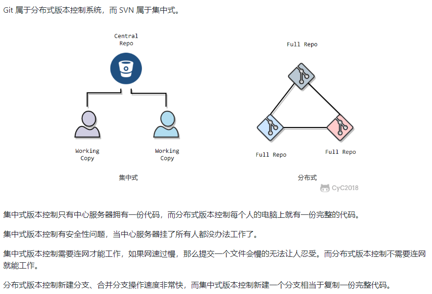

## 中心服务器

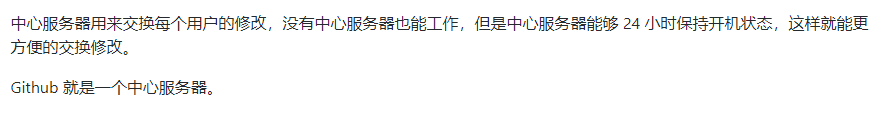

## 工作流

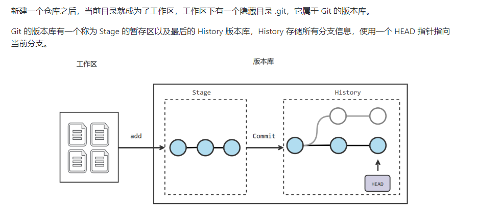

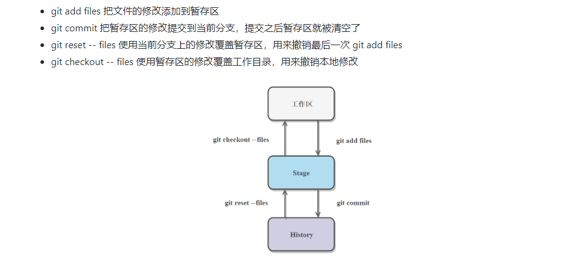

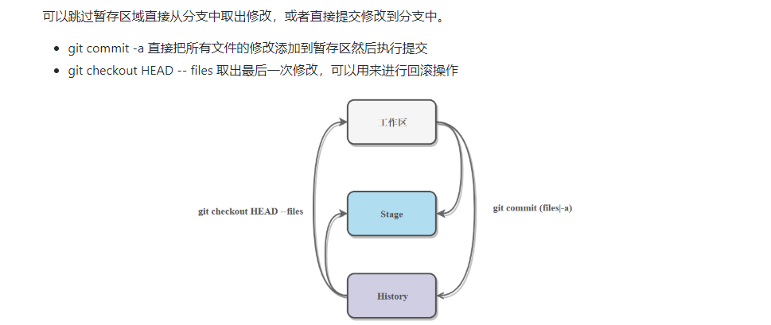


## Git一些基本概念

- 工作区和暂存区

  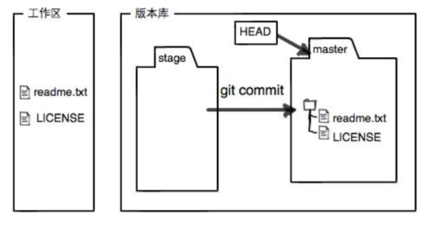

  工作区 git add 到暂存区，然后commit到本地版本库

## 一些指令

### 关于初始化

- git init
- git clone URL 或者直接克隆下来库就已经初始化了

### 关于添加到暂存区 

- git add .

### 关于提交

 把暂存区的修改提交到当前分支，提交之后暂存区就被清空了 。

- git commit -m " " [file]
- git commit -a 直接把所有文件的修改添加到暂存区然后执行提交 **！**
- git commit -m

### 关于移动指针

- git reflog
- git reset --hard 索引值
- git reset --hard HEAD^^
- gir reset --hard HEAD~3
- git reset 还有三个参数

### 关于修改

- `git checkout -- files` 使用暂存区的修改覆盖工作目录，用来撤销本地修改

  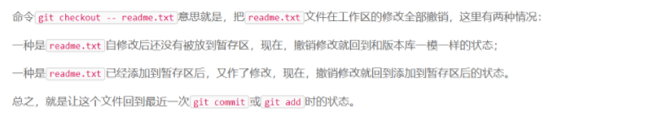

- `git reset -- files` 使用当前分支上的修改覆盖暂存区，用来撤销最后一次 git add files，针对修改了，还add到暂存区的操作。
  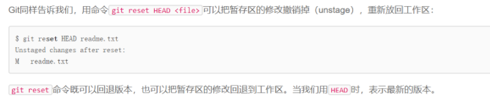

  把暂存区的修改撤销掉，重新放回工作区，还想撤销工作区修改的话，执行上面的checkout。

- 小结

  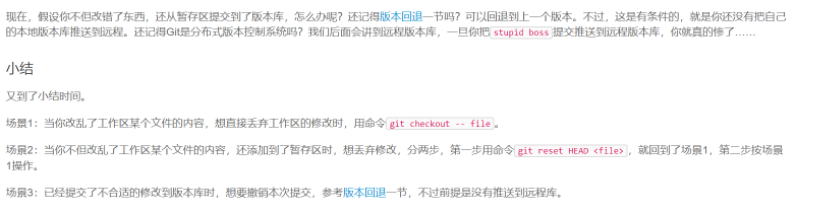

 

 

 

 

 

 

### 关于删除

- 想删除

  git rm  +  git commit

- 删错了

  git checkout -- xxx,恢复文件即可,前提是你commit了

  git checkout HEAD -- files 取出最后一次修改，可以用来进行回滚操作

### 关于远程库

| 指令                      | 含义            |
| ------------------------- | --------------- |
| git remote -v             | 查看define的URL |
| git remote add origin URL | 添加define的URL |
| git clone URL             | 克隆远程仓库    |
| git push origin master    |                 |
| git pull origin master    |                 |

- 几点说明

  - 不同步master会出错，所以最好先pull一下

  - 仓库不关联的问题

    - 先clone

    - 使用命令

      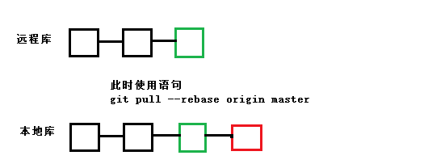

  - 有时候还会出现冲突，显示master|merge,此时需要先手动合并，然后```git add + git commit -m```

### 关于分支

#### 分支概念

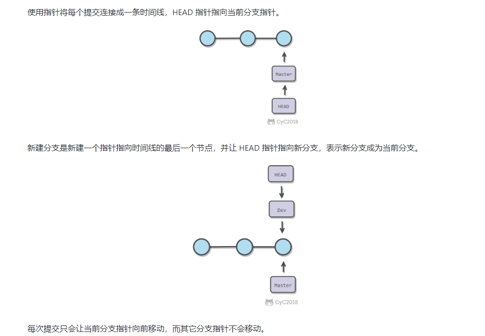

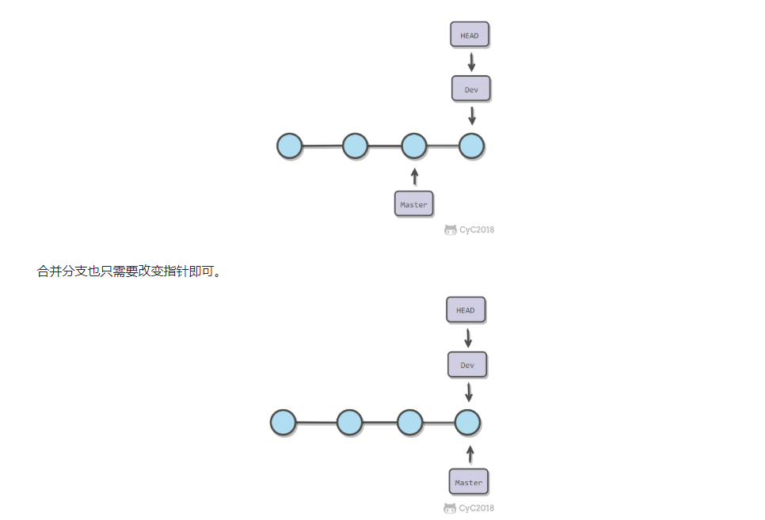

冲突合并和pull中出现的解决方法一样

#### Fast forward

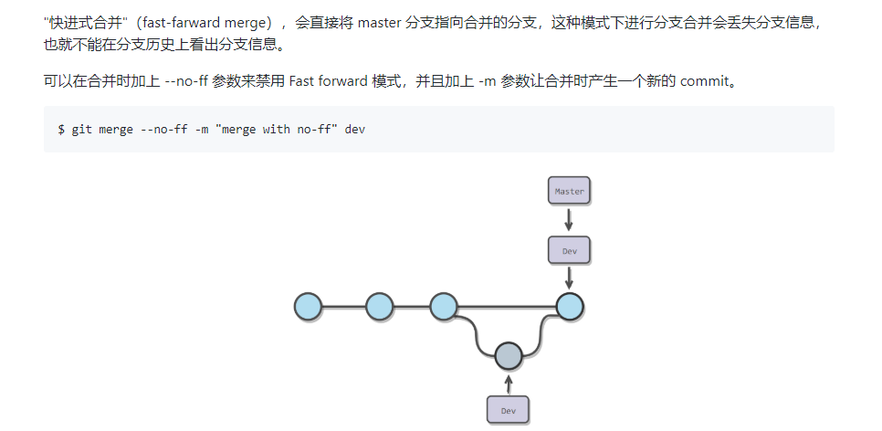

#### 分支管理策略

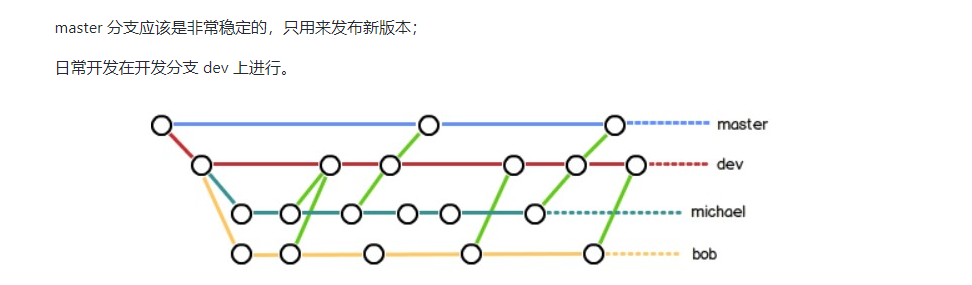

#### 分支指令

| 指令                                       | 功能      |
| ------------------------------------------ | --------- |
| git branch -v                              | 查看分支  |
| git branch name                            | 创建分支  |
| git checkout name / git switch name        | 切换分支  |
| git checkout -b name / git switch -c name  | 创建+切换 |
| git merge <哪一个分支的修改合并到当前分支> | 合并分支  |
| git branch -d name                         | 删除分支  |

###   git指令总结

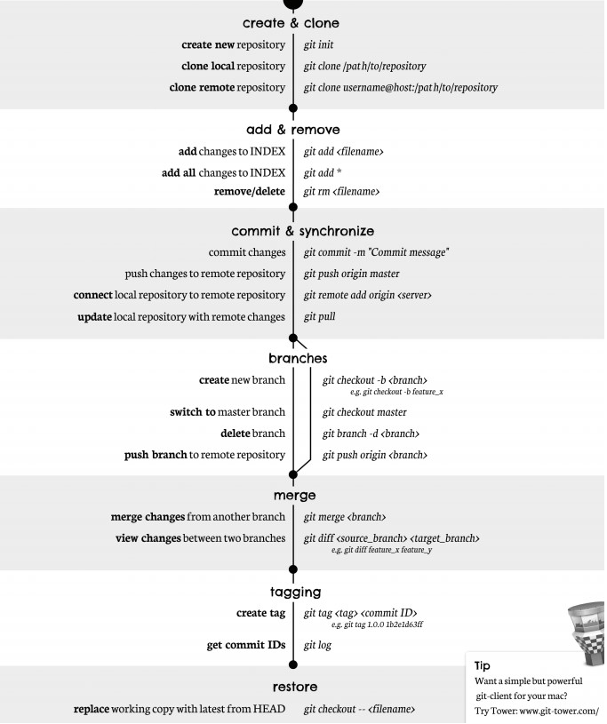 